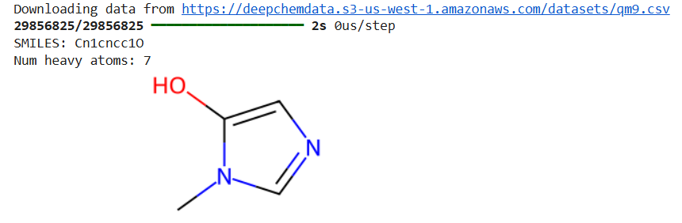
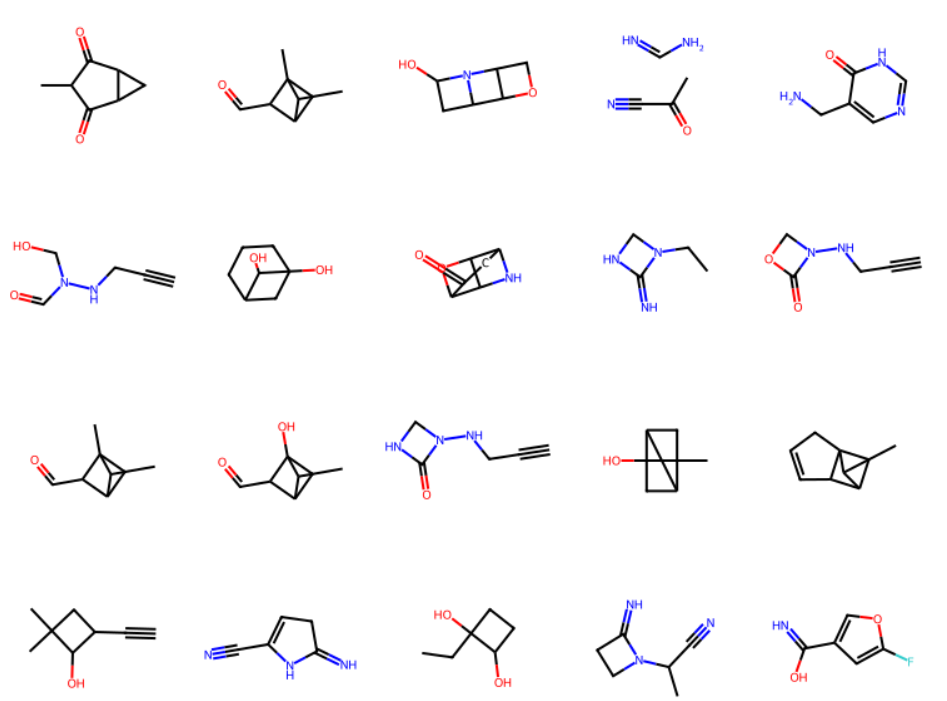

<h2 id="model-architecture">Model Architecture</h2>

This project implements a <strong>Wasserstein GAN with Gradient Penalty (WGAN-GP)</strong>
for molecular graph generation. The architecture consists of two main components:

<ul>
  <li><strong>Graph Generator</strong> – maps latent vectors to molecular graphs</li>
  <li><strong>Graph Discriminator</strong> – evaluates the realism of generated graphs using relational graph convolutions</li>
</ul>

Together, these networks learn to produce chemically plausible small molecules represented as graphs.

<h2 id="dataset">Dataset</h2>

The QM9 dataset contains small organic molecules with up to nine heavy atoms.
Below is an example molecule from the dataset:

  

<h3>Graph Generator</h3>

The generator maps a latent vector <code>z</code> to:

<ul>
  <li>a 3‑D adjacency tensor <code>A ∈ ℝ^{BOND_DIM × N × N}</code></li>
  <li>a 2‑D feature tensor <code>H ∈ ℝ^{N × ATOM_DIM}</code></li>
</ul>

<h4>Architecture Summary</h4>

<ol>
  <li>
    <strong>Fully-connected backbone:</strong>
    The latent vector is passed through several dense layers with <code>tanh</code> activations and dropout.
  </li>
  <li>
    <strong>Dual output heads:</strong>
    One head generates the adjacency tensor, and the other generates the feature tensor.
  </li>
  <li>
    <strong>Reshaping and normalization:</strong>
    Outputs are reshaped into graph tensors and normalized using Softmax. The adjacency tensor is symmetrized to enforce undirected bonds.
  </li>
</ol>

<h4>Design Considerations</h4>

<ul>
  <li>Continuous adjacency and feature tensors allow gradient-based learning.</li>
  <li>Symmetrization ensures chemically valid undirected bonding.</li>
  <li>Softmax approximates discrete categorical choices for atom and bond types.</li>
</ul>

<h3>Graph Discriminator</h3>

The discriminator receives a graph <code>(A, H)</code>—either real or generated—and outputs a scalar critic score.
It uses <strong>Relational Graph Convolutional Layers (R-GCN)</strong> to process molecular structure.

<h4>Relational Graph Convolution</h4>

Each layer performs the following operation:

<pre>
H^{(l+1)} = σ( Σ_r A_r H^{(l)} W_r )
</pre>

Where:

<ul>
  <li><code>A_r</code> is the adjacency matrix for bond type <em>r</em></li>
  <li><code>W_r</code> is a trainable weight matrix for relation <em>r</em></li>
  <li><code>σ</code> is a non-linear activation (ReLU)</li>
</ul>

<h4>Design Notes</h4>

<ul>
  <li>No degree normalization is applied, simplifying training on continuous adjacency tensors.</li>
  <li>No self-loops are added, preventing the generator from learning self-bonding.</li>
  <li>Continuous adjacency tensors from the generator are naturally supported.</li>
</ul>

<h4>Downstream Layers</h4>

<ol>
  <li><strong>Global Average Pooling</strong> reduces atom-level features to a molecule-level embedding.</li>
  <li><strong>Dense layers</strong> refine the representation.</li>
  <li>A final <strong>scalar output</strong> provides the critic score for WGAN-GP training.</li>
</ol>

<h3>Training with WGAN-GP</h3>

WGAN-GP stabilizes GAN training by enforcing a <strong>1-Lipschitz constraint</strong> through gradient penalty.
This is essential for graph generation, where:

<ul>
  <li>The discriminator must not overpower the generator.</li>
  <li>The generator must receive smooth, meaningful gradients.</li>
</ul>

Training alternates between:

<ul>
  <li>Multiple discriminator updates (with gradient penalty)</li>
  <li>One generator update</li>
</ul>

This encourages the generator to produce adjacency and feature tensors that resemble real molecular graphs.

<h2 id="results">Results</h2>

Below are sample molecules generated by the WGAN-GP model. These structures were
reconstructed from the generator's adjacency and feature tensors using RDKit.

  

The model successfully learns the distribution of small organic molecules and
produces chemically plausible structures.

<h3>Why This Architecture Matters</h3>

This model demonstrates:

<ul>
  <li>Understanding of graph-structured data and relational inductive biases</li>
  <li>Ability to implement custom Keras layers and training loops</li>
  <li>Familiarity with WGAN-GP and deep generative modeling</li>
  <li>Practical use of RDKit for molecular reconstruction</li>
</ul>
